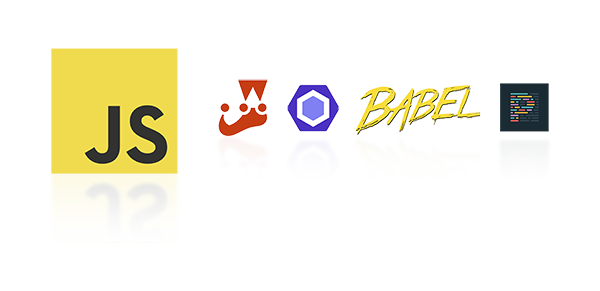

# ⚡ js-modern-starter

<div align="center"></div>

_A production-ready JavaScript starter template with ESLint v9 (Flat Config), Jest, Babel, and pnpm. Includes ES Modules support, opinionated linting, and pre-configured testing. Ideal for Node.js apps, libraries, and CLI tools._

[](https://developer.mozilla.org/en-US/docs/Web/JavaScript/Guide/Modules)
[](https://eslint.org/)
[](https://pnpm.io/)
[](https://opensource.org/licenses/MIT)
[](https://jestjs.io/)
[](https://github.com/oclcode/js-modern-starter/actions/workflows/ci.yml)

---

## 📦 Features

- ✅ **Modern JavaScript** (ES Modules)
- ✅ **ESLint v9** (Flat Config) + Prettier
- ✅ **Jest** with Babel support
- ✅ **pnpm** for fast, disk-space efficient dependency management
- ✅ **GitHub Actions** CI/CD pipeline
- ✅ **@/ aliases** for clean imports (no more `../../`)
- ✅ Ready-to-use test structure
- ✅ Opinionated but configurable

---

## 🚀 Getting Started

### 1. Use this template

Click the **"Use this template"** button on GitHub to create a new repository.

### 2. Install dependencies

```bash
pnpm install
```

### 3. Run tests

```bash
pnpm test
```

### 4. Start coding!

Edit `src/math.js` and add your own logic.

---

## 🛠 Setup

### Development

| Command           | Description               |
| ----------------- | ------------------------- |
| `pnpm test`       | Run tests with Jest       |
| `pnpm test:watch` | Run tests in watch mode   |
| `pnpm lint`       | Run ESLint                |
| `pnpm lint:fix`   | Fix ESLint issues         |
| `pnpm format`     | Format code with Prettier |

---

## 🔧 Configuration

### ESLint

- **Flat Config** (ESLint v9+)
- Rules:
  - `no-restricted-syntax`: Encourages functional methods over `for...of`
  - Strict mode with `eslint:recommended`
  - Jest and Node.js globals

### Jest

- Supports ES Modules via Babel
- Pre-configured test match: `**/tests/**/*.test.js`
- Coverage reports in `coverage/`

### Babel

- `@babel/preset-env` targeting current Node.js version
- **@/ aliases** for clean imports (configured in `babel.config.js`)

### Prettier

- Semi-colons: `true`
- Double quotes: `true`
- Tab width: `2`

### @/ Aliases

No more `../../`! Use `@/` to import from `src/`:

```javascript
// Before
import { add } from "../../src/math.js";

// After
import { add } from "@/math.js";
```

---

## 📝 Rules & Conventions

1. **No `for...of` loops**: Use `Array.prototype.forEach` or `Array.prototype.every` instead.
2. **ES Modules**: Use `import/export` syntax.
3. **Test coverage**: Aim for 100% coverage in `src/`.

```javascript
// ✅ Recommended
[1, 2, 3].forEach((item) => console.log(item));

// ❌ Avoid
for (const item of [1, 2, 3]) {
  console.log(item);
}
```

---

## 🔄 CI/CD

GitHub Actions workflow (`.github/workflows/ci.yml`):

- Runs on every `push` and `pull_request`
- Installs dependencies with pnpm cache
- Runs tests and linter

---

## Contributing

We welcome contributions! Please see our [Contributing Guide](CONTRIBUTING.md) for details on how to get started.

---

## Code of Conduct

We are committed to fostering a welcoming and inclusive community. Please review our [Code Of Conduct](CODE_OF_CONDUCT.md) to understand the standards of behavior expected from all participants in our community.

---

## 📄 License

This project is licensed under the MIT License - see the [License](LICENSE.md) file for details.
